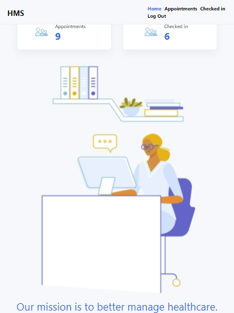
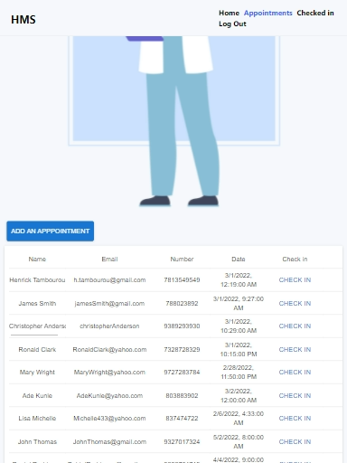
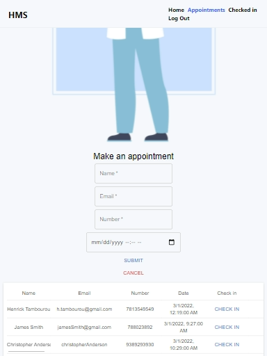
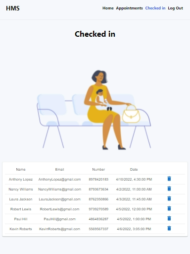
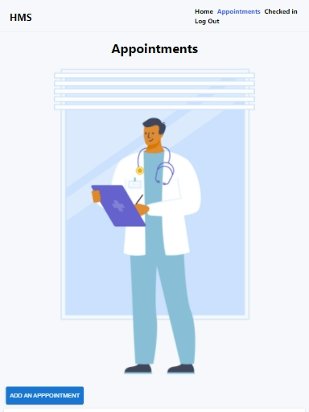

# Hospital Management

A full-stack application for a hospital to help manage patients efficiently. Giving users the ability to make appointments for patients, check patients in and delete appointments. Securely authenticates users.

- Created using the MERN stack.

## Built with

- React
- Node
- MongoDB
- Express
- Dotenv
- JWT Token
- Morgan
- Bcrypt
- Nodemon
- Mongoose
- Redux
- Material UI

## Testing

Used Postman Api to test backend requests.

### More pictures

